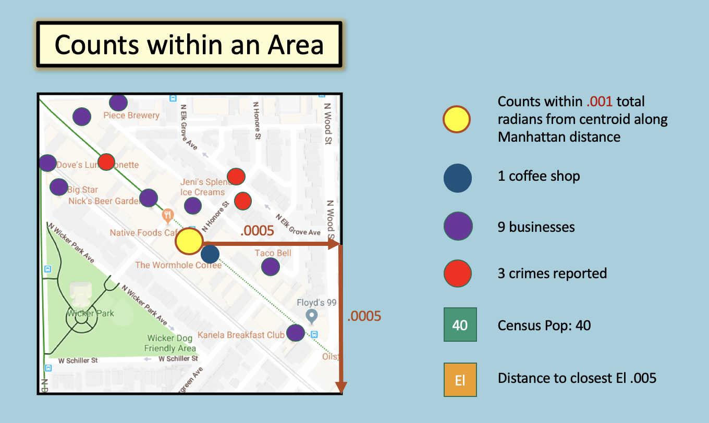
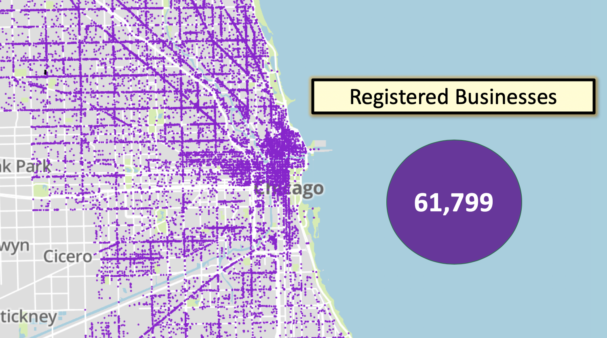
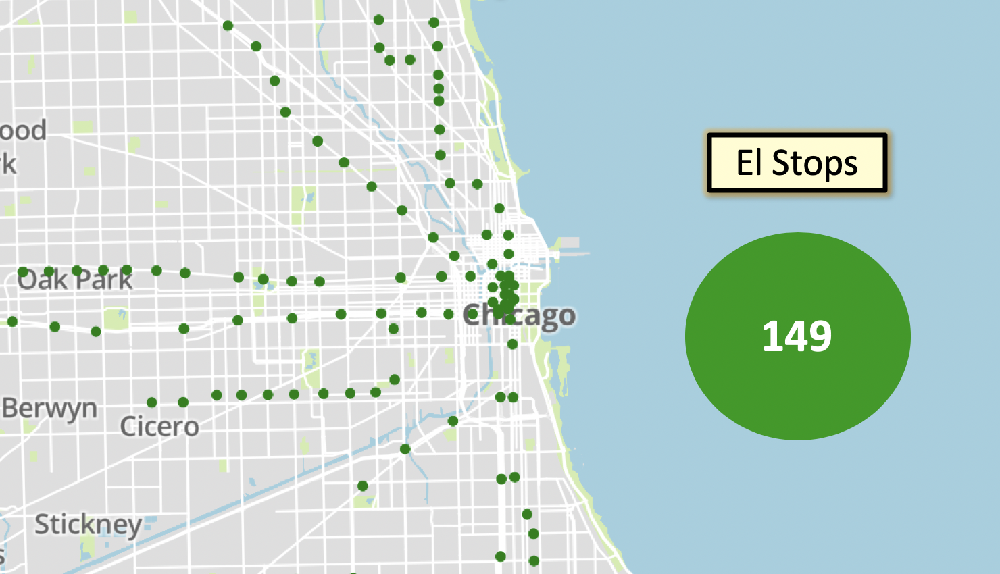
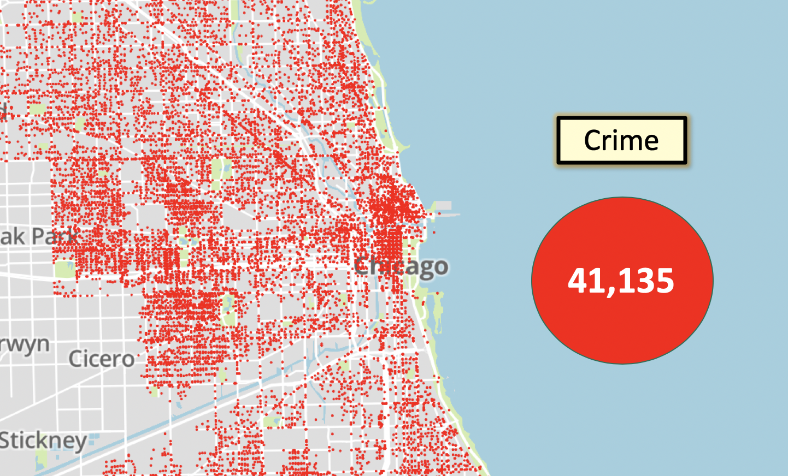
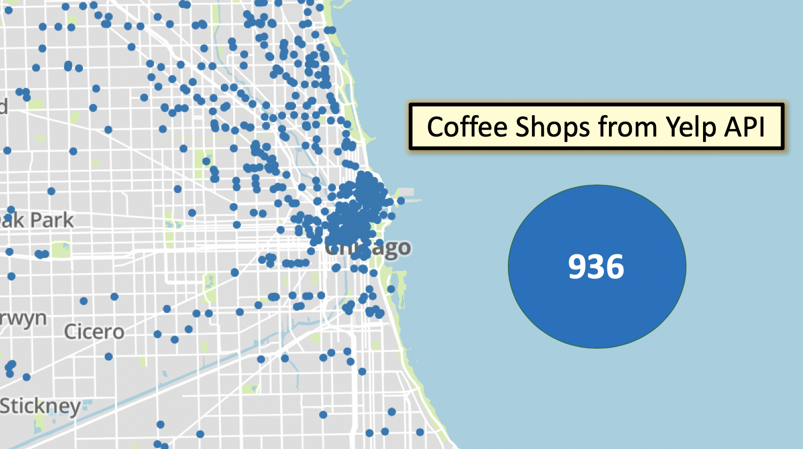

Recommender for Locations to Open a Coffeeshop in Chicago
===============

As a former barista, I have a deep love for coffee.  At least I think it's love, and not caffeine addiction. Aside from providing that sharpening jolt in the morning, coffee shops serve communities by providing safe spaces for conversation, study, and general low key fun.   

I am under strong impression that a community cannot have too many independent coffeeshops.  With that in mind, I created the present project, which uses clustering techniques on business and demographic data to identify potential locations in Chicago where a coffeeshop would thrive.

Data
===============

### Census Shapefiles
In order to translate the various data found below into machine learning ready form depends on census shape files. I use the lat/long centroid of each Chicago block shapefile to count the number of businesses, already existing coffeeshops, and reported crimes within a small square area. I also calculate distance to the nearest El stops and libraries.  View the code for these calculations [here](data/blockshapes).  

  
I use block shape from 2010 to allow me to map census population data to the final dataframe [here](https://www.census.gov/geographies/mapping-files/time-series/geo/tiger-line-file.2010.html).

## Chicago Data Portal
- Chicago active [businesses records](https://data.cityofchicago.org/Community-Economic-Development/Business-Licenses-Current-Active/uupf-x98q). 
     
   

- Location data for [Chicago Public Libraries](https://data.cityofchicago.org/Education/Libraries-Locations-Hours-and-Contact-Information/x8fc-8rcq) and [El stops](https://data.cityofchicago.org/Transportation/CTA-System-Information-List-of-L-Stops/8pix-ypme)__

  

- [Chicago crime records](https://data.cityofchicago.org/Public-Safety/Crimes-2001-to-present/ijzp-q8t2)__

  

## Yelp

- 936 Chicago coffee shops obtained via the Yelp API. 
- See code [here](./data/yelp) which shows API usage and Postgres storage

  

_
## Census.gov
- I collect household data for Chicago zipcodes from https://factfinder.census.gov/, which has recently been moved to https://data.census.gov/cedsci/. The original Selenium code used to scrape the data is found [here]('data/zip_mean_inc/').  A pickle of the gathered data can also be found in that folder.

Modeling
==========
Having composed dataframes which consist of rows corresponding to the above data as counted within 46290 square regions of Chicago, the data is ready for unsupervised modeling. There are no true labels for this project. How to categorize areas best suited to open a coffee shop involves some subjectivity.__

I try a variety of clustering methods, including kMeans, heirarchical agglomerative, mean shift, and dbscan. The code for the clustering models is found [here](./models/)

I find DBSCAN returns the best clusters of blocks, having the advantage of weeding out large portions of the city it deems noise.  

  
